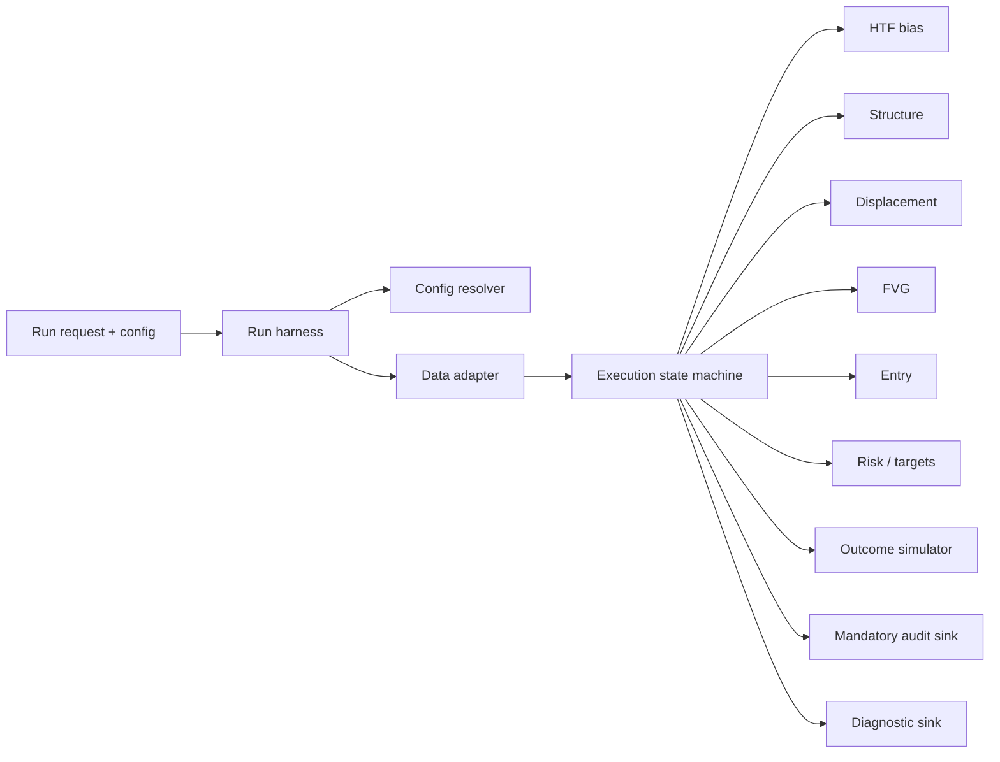

# Architecture

Barakat Bot V1 was designed as a contract-led, forward-only execution engine rather than a single monolithic strategy script.

## Contract boundaries

The preserved design defines 17 numbered contracts (0–16). Responsibilities are intentionally separated so infrastructure cannot silently invent strategy logic and strategy modules cannot own orchestration concerns.

| Contract | Responsibility |
|---:|---|
| 0 | Run harness / orchestration |
| 1 | Run identity and audit |
| 2 | Clock and time semantics |
| 3 | Configuration resolution |
| 4 | Execution-mode control |
| 5 | Data adapter |
| 6 | Execution state machine |
| 7 | Single-trade / execution policy |
| 8 | Higher-timeframe bias |
| 9 | Structure |
| 10 | Displacement |
| 11 | Fair Value Gap |
| 12 | Entry |
| 13 | Risk and targets |
| 14 | Outcome simulation |
| 15 | Mandatory sink logger |
| 16 | Diagnostic sink logger |

The original contract documents are retained in [`docs/contracts/`](contracts/).

## Deterministic execution principles

The design documents lock several engineering principles:

- process only information available at the current candle-close pointer;
- no hindsight or retroactive validation;
- normalized adapter inputs rather than strategy modules reading raw files directly;
- explicit state ownership;
- strict measurement/comparison rules;
- write-only logs rather than logs becoming execution state;
- configuration snapshots and run IDs for auditability;
- the same strategy semantics across historical replay/backtest and later execution modes.

The original authority documents remain private because they contain the production decision criteria. The public contract index records the module boundaries and engineering responsibilities without reproducing those rules.
